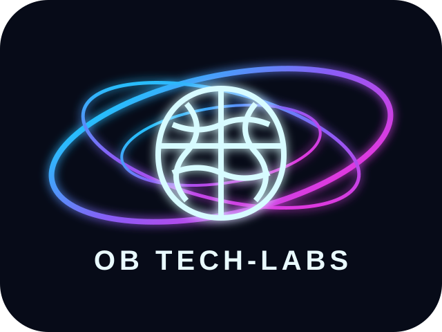

# VANES AI

**VANES AI — Verseversatile Adaptive Neuro Emergent System** is an online, learner-friendly AI study companion designed around the Tanzanian secondary-school curriculum.

**Made by OB Technologies Lab**

## 🚀 Use VANES online

The production app is deployed as a **Cloudflare Worker**:

**https://vanes-ai.obtechnologies625.workers.dev**

Students can open the app directly from a phone, tablet, or PC. No Command Prompt, Python, Node.js, or local server is required for normal use.

## 🎓 Personal learner profile

VANES now asks for the learner profile when the app opens for a new or incomplete profile:

- Full name
- **O-Level / CSEE or Advanced / A-Level**
- O-Level: **all subjects the learner takes** can be selected
- A-Level: the learner chooses an Advanced combination
- A-Level common subjects: **Historia ya Tanzania** and **Academic Communication**
- Profile context is sent to the AI so answers respond to the learner's **level, combination and subjects**, not just their name
- Profile picture can be the VANES default, a picture from the device, or an AI-generated non-identifying avatar

Supported common Advanced combinations include **PCM, PCB, PGM, CBG, CBA, CBN, EGM, ECA, HGE, HGL, HKL, HKA, HEC and HGLi**, with an `OTHER` option for a school-specific combination.

## 📚 Study plans and AI Study Coach

- Create a focused study plan from the planner
- **Save study plans** locally and reopen them later
- Keep up to 50 saved plans on the device
- Full-height AI Study Coach workspace for a more immersive study session
- Chat, practise, analyse, mark, summarise and plan
- Upload study images for analysis
- Generate educational images when the image service is available
- Continue working from notes and subject topic maps

## 🧪 Tanzanian examination paper structure

VANES study cards now show the paper structure used by its curriculum mapping:

- **Physics, Chemistry and Biology:** Paper 1, Paper 2 and Paper 3
- **Most two-paper Advanced subjects:** Paper 1 and Paper 2
- **Historia ya Tanzania:** Paper 1 only
- **Academic Communication:** Paper 1 only

## 🧭 Curriculum coverage

### O-Level / CSEE

Kiswahili, English Language, Basic Mathematics, Basic Applied Mathematics, History, Geography, Chemistry, Physics, Biology, Civics, Information and Computer Studies, Commerce, Bookkeeping, Agriculture, Food and Nutrition, Fine Art, Music, French, Arabic, Bible Knowledge, Islamic Knowledge, Physical Education, Economics, Business Studies and Computer Applications.

### Advanced / A-Level

Advanced Mathematics, Economics, History, Geography, Physics, Chemistry, Biology, Historia ya Tanzania, Academic Communication, Kiswahili, Computer Science, Accountancy, Commerce, Business Studies and Computer Applications, with combination-aware personalisation.

## 🎨 Cyberpunk identity

VANES AI uses a new **six-turbine wheel** visual identity with a cyberpunk neon treatment. OB Technologies Lab uses a **brain surrounded by orbital halos**, also in a cyberpunk technology style. The same identity is used across the app dashboard, navigation branding and this README showcase.

## 🔐 AI security

The frontend uses the Cloudflare Worker API proxy. Keep `OPENROUTER_API_KEY` server-side as a runtime secret. Never commit a real API key to browser JavaScript, README files, screenshots, or GitHub.

## 🌐 Availability

The Cloudflare Worker provides the public app URL without requiring a developer PC to stay on. Students only need an internet connection.

## 👨‍💻 Made by OB Technologies Lab

VANES AI is a project by **OB Technologies Lab** — building adaptive educational technology for Tanzanian learners.
