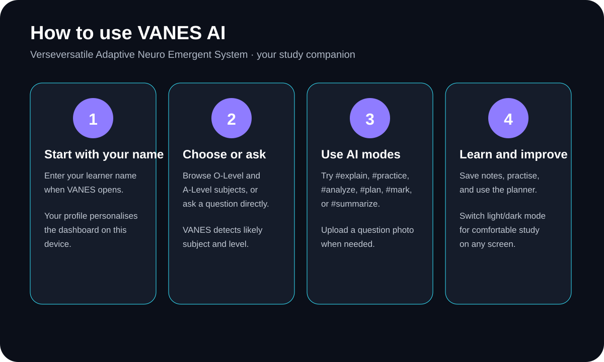

# VANES AI

**VANES AI — Verseversatile Adaptive Neuro Emergent System** is an online, learner-friendly study companion designed around the Tanzanian secondary-school curriculum. It is built to adapt to what a student is asking, detect the likely subject and level, explain concepts, analyse work, create practice, organise study time, and work with study images.

## 🚀 Use VANES online

The intended public version of VANES runs on **Vercel**, so students can open one normal web link from a phone, tablet or PC. There is **no Command Prompt command and no local server required for students**.

### First-time setup for the owner

1. Open [Vercel](https://vercel.com/) and sign in with GitHub.
2. Import **`obtechnologies625-lab/VANES-AI`**.
3. Use **Other** as the framework preset and leave the build command empty.
4. Click **Deploy**.
5. In the Vercel project, open **Settings → Environment Variables**.
6. Add this variable:

   `OPENROUTER_API_KEY`

7. Paste your real OpenRouter API key into the **Value** field. Do **not** put the real key into `app.js`, README files, screenshots, or GitHub.
8. Enable it for **Production** (and Preview/Development if you want those environments to use AI too).
9. Redeploy the latest deployment.
10. Vercel gives the project a permanent public URL such as `https://your-project-name.vercel.app`. That is the link students can use on mobile and PC.

> **Important:** The `/api/chat` server endpoint is included so the OpenRouter secret can stay on the server. GitHub Pages can host the static interface, but it cannot execute the server endpoint. For the complete online AI version, use the Vercel deployment as the main public app.

### Where is the OpenRouter API key?

**Put it in Vercel, not in the browser code:**

**Vercel → your VANES project → Settings → Environment Variables → Add New**

- Name: `OPENROUTER_API_KEY`
- Value: your OpenRouter secret key
- Environment: Production (also Preview/Development if desired)

The repository already contains the secure endpoint at **`/api/chat.js`**. You should never send the secret key to ChatGPT or commit it to GitHub.

## 📱 How students use VANES

1. **Enter your name.** The first screen asks for the learner's name and creates a local learner profile on that device.
2. **Choose a subject or ask directly.** VANES includes O-Level/CSEE and A-Level/ACSEE subject areas and can detect the likely subject from a question.
3. **Ask VANES.** Questions can be written in English or Kiswahili.
4. **Choose an AI mode when useful:** `#explain`, `#practice`, `#analyze`, `#plan`, `#summarize`, `#translate`, or `#mark`.
5. **Upload a study image.** Use a photo of a question, handwritten work, notes, graph, diagram or textbook page and tell VANES what to do with it.
6. **Use the planner and notes.** Build focused sessions and keep important study notes.
7. **Switch themes.** Use the Light/Dark mode control for comfortable studying in different environments.

## 🎓 Curriculum coverage

The app contains a broad Tanzanian secondary-school subject library and topic maps for AI context, including:

- Kiswahili
- English Language
- Basic Mathematics
- Basic Applied Mathematics
- Advanced Mathematics
- History
- Geography
- Chemistry
- Physics
- Biology
- Civics
- Information and Computer Studies
- Commerce
- Bookkeeping
- Agriculture
- Food and Nutrition
- Fine Art
- Music
- French
- Arabic
- Bible Knowledge
- Islamic Knowledge
- Physical Education
- Economics
- General Studies
- Computer Science
- Accountancy
- Business Studies
- Computer Applications

Some subjects can exist at different levels, and schools may offer different combinations. VANES should be treated as a study assistant and its answers should be checked against the learner's current teacher, textbook and official syllabus where accuracy is critical.

## 🧠 What makes VANES different?

The name **VANES** represents **Verseversatile Adaptive Neuro Emergent System**. The product direction is for the system to adapt its help to the learner rather than behaving like a simple question-and-answer page.

The long-term VANES experience can combine:

- Subject and level detection
- Tanzanian curriculum context
- Multi-turn AI study chat
- Step-by-step explanations
- Practice questions and marking guidance
- Mistake analysis and correction
- Study planning
- Revision summaries
- Image/question analysis
- Educational image generation where the selected model supports it
- Personal learner profile
- Notes and progress tracking
- Light and dark themes
- Mobile-friendly responsive interface

## 🛠️ Development

Students do **not** need to run commands to use the public app.

For the owner/developer, the project is a lightweight web app with no required npm build step. Development can still be done locally when needed, but the normal student experience is the deployed Vercel URL.

## 🔐 Security

The public production deployment should use the server-side OpenRouter endpoint in `api/chat.js` with the Vercel environment variable `OPENROUTER_API_KEY`.

Never commit a real API key. If a key has ever been exposed in browser code or a public repository, rotate/revoke it in OpenRouter and replace it with a new secret stored in Vercel.

## 🌐 24-hour availability

Vercel provides the public hosting needed for an always-accessible web URL. The app does not need a PC with Command Prompt running in order for students to open the site. AI requests are handled by the deployed server endpoint and OpenRouter when the user is online.

The app can also be added to a compatible phone's home screen as a web app because VANES includes a web manifest and app-shell service worker.

## 👨‍💻 Made by OB Technologies Lab

VANES AI is a project by **OB Technologies Lab**.
